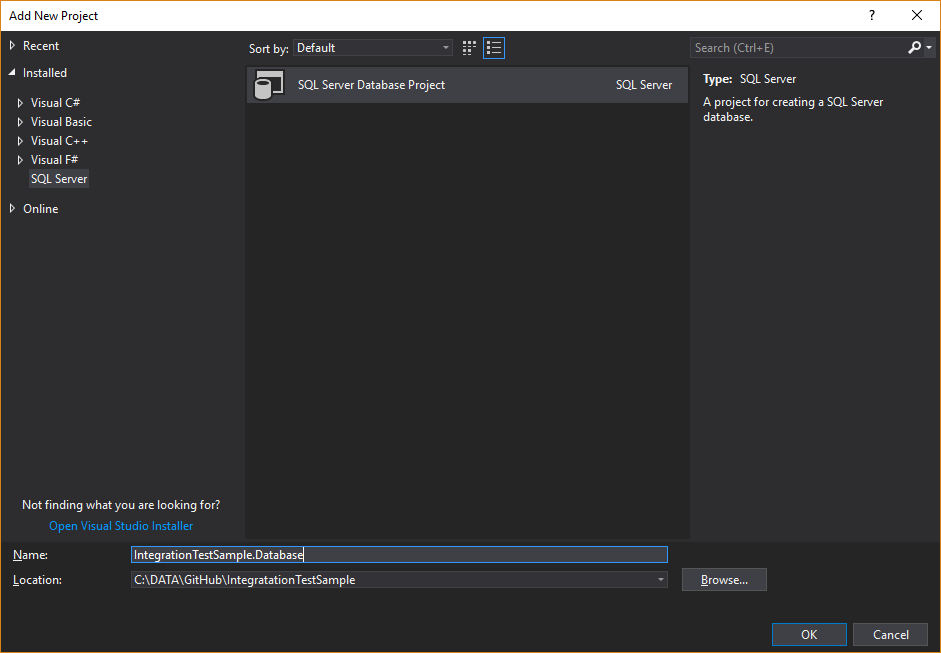
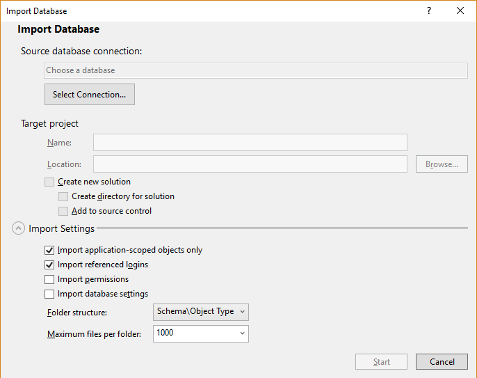
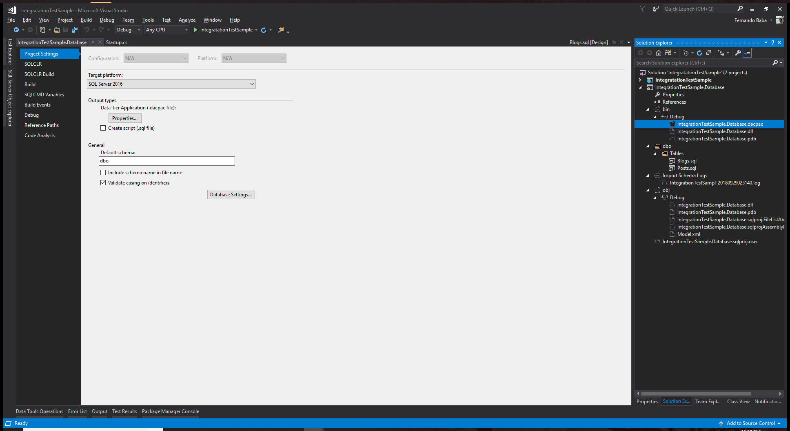

# Integration tests on dotnet core 2.1 with xUnit

It is a fact that writing integration test is challenge. There are many aspects that makes it an expensive process and at times, hard to maintain and hard to write such tests.
In adition, there are so many different approaches that it is hard to define what would work well with the structure of the development team.

Recently, my team has decided to implement a full strategy for automated tests. As such, the integration suite was a key factor to achieve a good level of coverage and ensure the quality of the product. I'll not go through the rationale and motivation for this. There are plenty of articles around the internet that can get enlighten your view around this subject. Instead, this article will focus on key points we wanted to achieve with this suite.

## Testing against a real api

One of the core goals was the ability of having an integration test suite that would be able to run against a real Web Api without having to maintain a proper environment. The main reason is the fact that the maintainability of such environment is complex and often does not provide a good ROI (Return Over Investment) meaning that the benefits vs the time spent on keeping such structure is often not worth it.

This seems to be reality for many teams and I believe this is part of the rationale for Microsoft to produce a really neat and easy solution. I'm talking about the `Microsoft.AspNetCore.MVC.Testing` library.

There's a good article on how to set up so once again, I'll not re-invent the wheel. Please check [this article](https://docs.microsoft.com/en-us/aspnet/core/test/integration-tests?view=aspnetcore-2.1) to get the grasp on what the library does.

To use this library

### Package Manager Console

> `Install-Package Microsoft.AspNetCore.Mvc.Testing`

### .NET Cli

> `dotnet add package Microsoft.AspNetCore.Mvc.Testing`

## Testing against a real database

The second key goal was to run the integration tests against a real database. Throughout my years of development, I often see teams creating a base database and creating backups and within the integration tests, restore this backup and run the tests against it.

Althought it is a viable solution, it also carries a lot of effort to maintain the database, specially when the product is on active development of new functionalities and therefore, it's likely the database schema would have constant changes over time. This implies that every time there's a change on the db structure, one would have to upgrade the database, create a new backup file and modify possible changes on the initial seed data.

We wanted to eliminate that!

The solution was combining the power of the `Microsoft.AspNetCore.MVC.Testing` and a database deployment strategy using DacPac. If you don't know what that is, please take some time to understand it. [This is a great starting point](https://docs.microsoft.com/en-us/sql/relational-databases/data-tier-applications/data-tier-applications?view=sql-server-2017).

Ok...enough talk. Let's go to some practical things.

## Setting our structure

Let's assume you already have an API application running with an existing database structure. If you don't have a Sql Project running for Dacpac, let's create one.

The first thing is to add a new project to your solution.



This should create a new project on your solution. Next, we will import an existing database to be deployable.

On Visual Studio, right click on the new database project and click Import > Database.



Find your existing database by clicking on Select Connection.

Follow the dialogs and proceed with the import.
The result should be similar to the following.


You will notice that SQL Server automaticatically generated the sql scripts to create the tables within your database. It will cater for everything, including `Functions`, `Stored Procedures`,`Constraints`, `Triggers`, etc.

This project is now compilable and the result of it is a dacpac file as highlighted on the above image.

Now we are ready to consume it within our Integration Tests and you can go further and use this project to actually manage the database structure for future deployments. This is an entire subject on its own =)

## Leveraging LocalDb

Another important part of this suite was that we didn't want to rely on an external SQL Server nor rely on adding external Sql servers that might have incurred into possible connectivity issues and therefore, making the tests less reliable.

LocalDb is a great choice if your application does not use anything fancy or things. [Here's a good article](https://blogs.msdn.microsoft.com/jerrynixon/2012/02/26/sql-express-v-localdb-v-sql-compact-edition/) showing the differences between the versions of SQL server. Choose what's more appripriate for your solution. On this article I'll use LocalDb.

## xUnit Shared context

Usually most of the testing frameworks use the concept of Test `TearUp` and `TearDown` to provide logic that common for your test cases such as run setup before the test class, after the test class, before each test, etc.

For xUnit, it works slightly different and I highly recommend have a look on the [xUnit documentation](https://xunit.github.io/docs/shared-context.html) to understand how this works as it will be important for what comes next.

## Wrapping things up

Ok, so now we have the core concepts in place and what we want from this Integration Test Suite. Let's put some code in place.

First, based on the shared context from xUnit, we will create the database and populate the seed data that can be used accross the entire Integration Suite.
In order to do that, we need to leverage the usage of `ITestCollectionOrderer`. This will allow us to order which test class will run first.

```csharp
    public class CollectionOrderer: ITestCollectionOrderer
    {
        public const string TypeName = "IntegrationTests.Orderers.CollectionOrderer";
        public const string AssemblyName = "IntegrationTests";

        /// <summary>Orders test collections for execution.</summary>
        /// <param name="testCollections">The test collections to be ordered.</param>
        /// <returns>The test collections in the order to be run.</returns>
        public IEnumerable<ITestCollection> OrderTestCollections(IEnumerable<ITestCollection> testCollections)
        {
            return testCollections.OrderBy(GetOrder);
        }

        /// <summary>
        /// Test collections are not bound to a specific class, however they
        /// are named by default with the type name as a suffix. We try to
        /// get the class name from the DisplayName and then use reflection to
        /// find the class and OrderAttribute.
        /// </summary>
        private static int GetOrder(ITestCollection testCollection)
        {
            var collectionName = testCollection.CollectionDefinition.Name;
            var collectionType = Type.GetType(collectionName);
            if (collectionType != null)
            {
                var att = collectionType.GetCustomAttributes<CollectionOrderAttribute>();
                return att?.FirstOrDefault()?.Order ?? 100;
            }

            return 100;
        }
    }
```

> Note: Using a custom attribute makes it easier to order things.

```csharp
    internal class CollectionOrderAttribute: Attribute
    {
        public CollectionOrderAttribute(int order)
        {
            Order = order;
        }

        public int Order { get; }
    }
```

With that in place, we can create a fixture that will be responsible for the following:

### The Bootstrap test class concept

Seed data is often one the biggest challenges as it serves as the base for all tests. Along with this test data, if one is not careful, you may end up with dirty data that can disrupt other tests unintentially and therefore, our team chose to create a set of tests that beyond assessing the logic of the code, it has the purpose to populate the initial data that will be shared across the entire test suite.

One way to deal with this is create a dedicated fixture that should run before any other test and this should be part of its own `collection`. 

``` csharp
    [CollectionDefinition(nameof(BootstrapCollection))]
    [CollectionOrder(0)]
    public class BootstrapCollection : ICollectionFixture<BootstrapFixture>
    {
    }

    [CollectionDefinition(nameof(IntegrationTestCollection))]
    [CollectionOrder(1)]
    public class IntegrationTestCollection : ICollectionFixture<IntegrationTestFixture>
    {
    }
```

> NOTE: As per **xUnit** documentation, the collection classes don't have any sort of logic. Their purpose is to order the collection, but still is necessary to create the concrete implementation of the **xUnit** interface `ICollectionFixture<TFixture>`.

The key point here is to attach specific fixtures to the collections and remember the following:

* The collections will be sorted prior execution of any test
* The fixture`s constructor will run at the beginning of the first class attached to the collection.
* Sadly, you cannot order the classes to run within a collection.
* The fixture`s dispose will run at the end of the collection execution. 

On the above snippet, the `BootstrapCollection` will run first and will only have one test class attached to it.
Every other test class will be part of the `IntegrationTestCollection` and should be executed in isolation.

As you can notice, they both have different fixtures attached to it.

#### BootstrapFixture

The bootstrap fixture has the purpose of:

##### Setup

* Create a base LocalDb instance
* Create a blank database
* Deploy the DacPac with the base database schema
  
##### Clean up

* Detach the `.mdf` of the database with all seed data
* Copy the `.mdf` to a location where the other classes can pickup and re-use it.

#### IntegrationTestFixture

The `IntegrationTestFixture` has the purpose of:

##### Setup

* Make a copy of the `bootstrap.mdf`
* Create a new temp instance on the LocalDb
* Attach the copy of the `bootstrap.mdf`
  
##### Clean up

* Stop the temp database
* Delete the temp instance
* Destroy the temp directory so it eliminate the copy of the `bootstrap.mdf`.